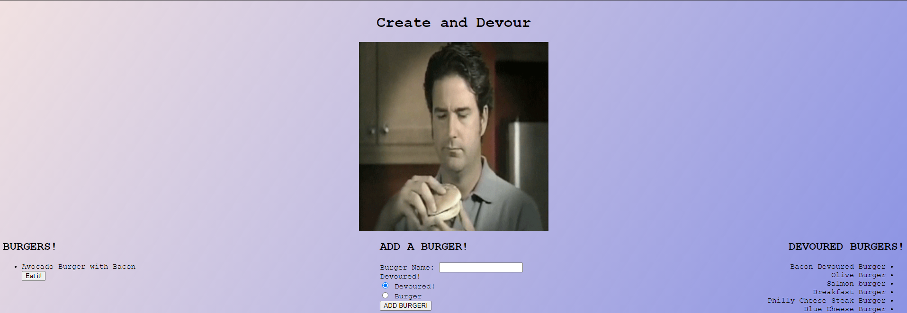

# Create and Devour
Burger logger with MySQL, JawsDb, Node, Express, Handlebars and a homemade ORM, yum!

## Notes
Create and Devour is an application designed to utilize and demonstrate the power of the interconnected parts of MCV (model/view/controller).  This abstraction allows development of modern applications to seperate the data and view portions - which allows for easier updating, collaboration, and debugging.  

## Usage
To demonstrate the functionality of the application, I have built a simple form that allows for the input of a string (preferrably, a burger name) and allows the user to add it to our database.  When you enter your burger name, you are asked to decide if the burger should go to the left column for viewing, or should be devoured - depending on which you select the data will be sent to the appropriate page heading.  If you decided to add your burger to the 'Burgers!' heading, you can then 'eat it' and send it to the devoured side of the page - where, as of deployment, it will live forever.  

## Screenshot and Live Link
You can view the active page here https://salty-fjord-70234.herokuapp.com/. 

